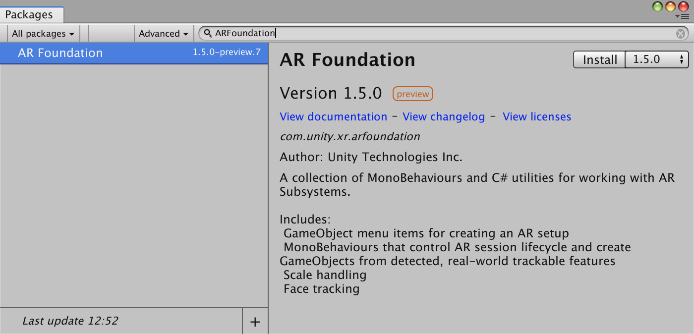
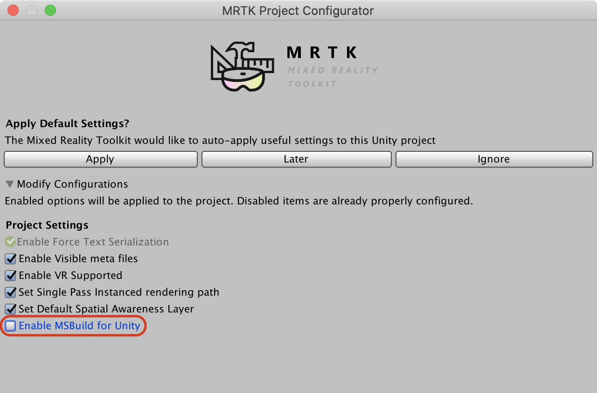
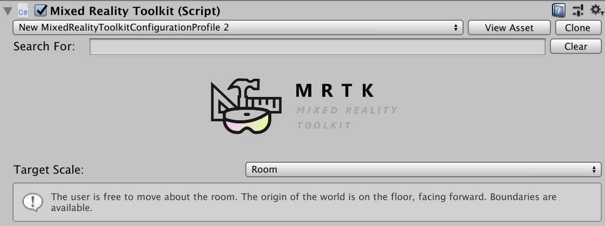

# Setting up MRTK on iOS

Authors: Srinjoy Majumdar
Date: Jan 14, 2020
Published: Yes
Slug: setting-up-mrtk-on-ios

In this tutorial I walk through how I setup the open source Mixed Reality Toolkit (MRTK) the framework which drives the interactions on Hololens 2 on iOS. I'll be mostly following a couple guides from Microsoft on getting started but also throw in some notes on issues I hit during the setup process.

---

In this tutorial I walk through how I setup the open source Mixed Reality Toolkit (MRTK) the framework which drives the interactions on Hololens 2 on iOS. I'll be mostly following a couple guides from Microsoft on getting started but also throw in some notes on issues I hit during the setup process.

[Getting started with MRTK](https://microsoft.github.io/MixedRealityToolkit-Unity/Documentation/GettingStartedWithTheMRTK.html)

[How to configure MRTK for iOS and Android [Experimental]](https://microsoft.github.io/MixedRealityToolkit-Unity/Documentation/CrossPlatform/UsingARFoundation.html)

## Install Unity

The first step to getting MRTK running is installing Unity and Visual Studio 2019. MRTK is supported on other platforms but it looks like Unity is the easiest way to get started with the framework. 

Unity versions 2019.1.x, 2019.2.x and 2018.4.x were supported when this article was written, however, I recommend installing **2018.4.x** through Unity Hub because I was not able to get the UnityAR plugin running properly on Unity 2019.x.

Unity Hub Download Link: [https://public-cdn.cloud.unity3d.com/hub/prod/UnityHubSetup.dmg](https://public-cdn.cloud.unity3d.com/hub/prod/UnityHubSetup.dmg)

## Installing MRTK Packages

Now that we have Unity installed, we need to install a few AR packages to set it up for MRTK. We first need to install the ARFoundation and ARKit packages. To do this, open the Package Manager on Unity, search for the package name and click install.

Unity Package Manager

Note: The ARFoundation package on Unity 2018.4.x is in preview so you need to enable preview packages on the Package Manager. This option is under Window > Package Manager > Advanced > Show Preview Packages

We can now install the custom MRTK packages. Go to the [MRTK GitHub releases page](https://github.com/Microsoft/MixedRealityToolkit-Unity/releases) and download the following packages from the latest release: 

- Microsoft.MixedRealityToolkit.Unity.Foundation
- Microsoft.MixedReality.Toolkit.Providers.UnityAR
- Microsoft.MixedRealityToolkit.Unity.Examples

Install the three packages by selecting the "Assets > Import Package > Custom Package" menu item and selecting each .unitypackage file

Note: If you're using a Mac, uncheck the "Enable MSBuild for Unity" Checkbox in the default configuration when installing the MRTK package. It will keep prompting you to check this box, but click the ignore button to silence the alert. This caused lots of headaches in the setup process for me but it is a [known issue](https://github.com/microsoft/MixedRealityToolkit-Unity/issues/6947) and will likely be fixed soon.

## Setting up the example scene

It's time to get a scene into our project! To make sure everything works, we'll setup the HandInteractionExamples demo that was shown with the Hololens 2 debut. Open the Assets/MixedRealityToolkit.Examples/Scenes/HandInteractionExamples scene using the project navigator pane at the bottom of Unity.

Next, we need to add the UnityAR Camera settings provider to the scene. Make a copy of the script by clicking the clone button as shown below. 

Add the `MixedRealityToolkit` object to the scene from the "Mixed Reality Toolkit/Add to Scene and Configure" tab

## Build Settings

Change the build target of the Unity project to iOS, this might regenerate the assets in the project. 

Note: Uncheck the "Strip Engine Code" option in Player Settings to prevent build errors in Xcode.